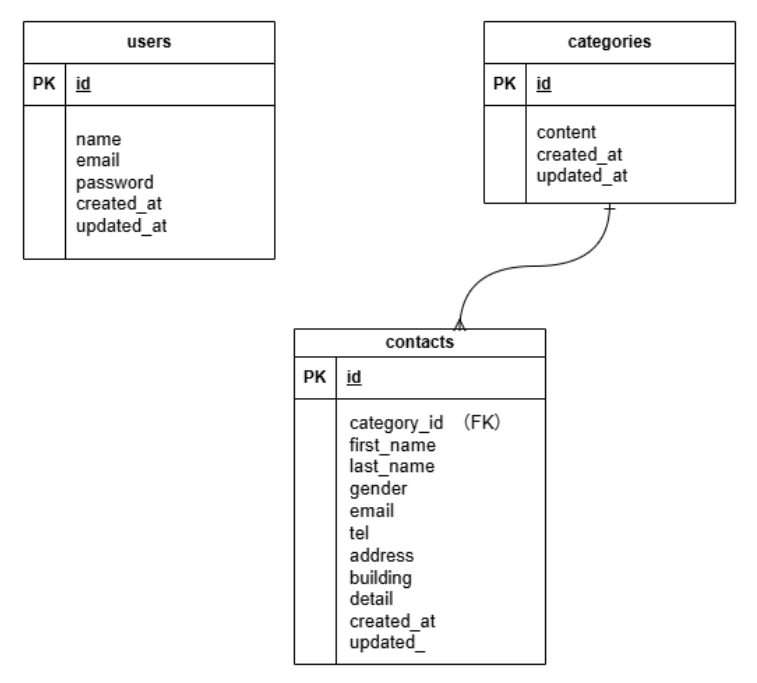

# laravel-docker-template

## 環境構築

Dockerビルド
・git clone git@github.com:Estra-Coachtech/laravel-docker-template.git
・mv laravel-docker-template coachtech-contact-form
・git remote set-url origin git@github.com:105lovechildren-yui/coachtech-contact-form.git
・docker-compose up -d --build

## Laravel環境構築

・docker-compose exec php bash
・composer install

<!-- ・php artisan key:generate -->
<!-- ・php artisan migrate
・php artisan db:seed -->

## 開発環境

・お問い合わせ画面:
・ユーザー登録:
・phpMyAdmin:http://localhost:8080/

## 使用技術（実行環境）

・PHP 8.1.34
・Laravel 8.83.8
・Composer version 2.7.1 2024-02-09 15:26:28
・Mysql 8.0.26
・nginx 1.21.1

<!-- ・jQuery -->

## ER図

## URL
